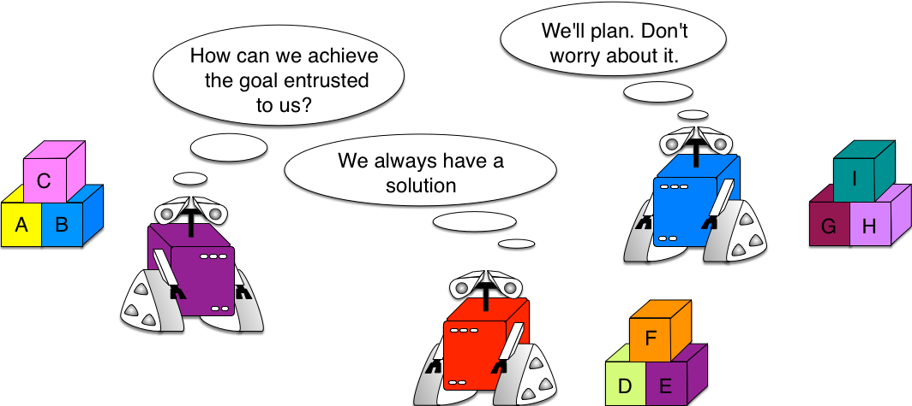
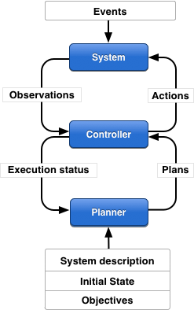

# Intro

This section talks about the need for a formal way to describe a planning model and various ways to achieve the given tasl

**Table of contents**
* [Planning](https://github.com/MuvvalaKaran/Learn-PDDL/blob/master/Introduction/README.md#What-is-planinng)
* [Docking Example](https://github.com/MuvvalaKaran/Learn-PDDL/blob/master/Introduction/README.md#Robot-Dockers---an-example)
* [Planning Models](https://github.com/MuvvalaKaran/Learn-PDDL/blob/master/Introduction/README.md#The-planning-model)
* [Underlying Assumptions](https://github.com/MuvvalaKaran/Learn-PDDL/blob/master/Introduction/README.md#Model-assumptions)
* [Various approaches](https://github.com/MuvvalaKaran/Learn-PDDL/blob/master/Introduction/README.md#A-set-of-techniques)
* [Further Reading](https://github.com/MuvvalaKaran/Learn-PDDL/blob/master/Introduction/README.md#References)

Note : This section is borrowed from [1] with slight tweaks!

# What is planning?

"Planning is a discipline of Artificial Intelligence that aims at the development of generic algorithms allowing autonomous systems to choose and organize their actions to achieve a goal by anticipating their effects (Ghallab, M. and al., 2004)"

## Robot Dockers - an example

Imagine a system where robots have to transport containers and store them. In this system, every event and action could be predefined and hard-coded but this approach has many shortcomings: complexity, combinatory explosion of the possible scenarios, vulnerability to failures and unexpected events etc.

Another approach is to bet on autonomy technologies such as AI planning and let the robots make their own decisions according to their perceptions and the state of the world.

**In the situation above, the goal is to stack container c2 on container c1 at location p2. Automated planning allows to compute a sequence of actions (plan) that will allow the autonomous robots r1, crane1, crane2 to achieve this task from the initial state (c1 is on c2 at p1). What is important to understand here is that if the initial state were different (due to an unexpected event or failure), the system would be able to compute another plan to fulfill the task.**

## The planning model

The conceptual model of planning is made of three components:

* A state transition system that models the evolution of the environment,
* A controller that chooses the next action to execute and controls its execution,
* A planner that, from the specification of a problem in PDDL, synthesizes a plan, i.e., a set of ordered actions, to achieve a goal.

## Model Assumptions

Often, planning models do many simplifying assumptions about the real world:

* The environment is finished
* The environment is completely observable
* The environment is deterministics
* The solution plans are sequential
* The notion of time is implicit, e.g., actions have no duration
* Planning does not interleave action execution
* Planning is a centralized procedure etc.

## A set of techniques

Classical representations of planning problems are based on logical representations, e.g., PDDL, OPL, etc. or state variables which are often more compact.

Planning algorithms can be classified in different approaches:

* State space planning
* Plan space planning
* SAT and CSP techniques
* Hierarchical planning techniques (HTN)
* Planning Graph techniques
* Markov Decision Process techniques
* Model Checking techniques etc.

## References 

> [1] https://github.com/pellierd/pddl4j/wiki/Automated-planning-in-a-nutshell 
