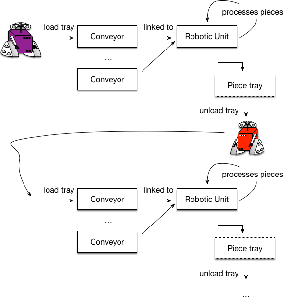

# Description
A repository for personal notes for getting started with PDDL.

<!---
image link : https://github.com/pellierd/pddl4j/wiki/A-Real-Industrial-Use-Case
-->

**Table of Contents**
* [Introduction](https://github.com/MuvvalaKaran/Learn-PDDL/tree/master/Introduction) : Discusses the why, and the what aspect of planning in general 
* [pddl](https://github.com/MuvvalaKaran/Learn-PDDL/tree/master/pddl): A pragmatic guide on how to write pddl files! 

Feel free to contribute to these notes. 

# CONTACT 
Please reach out to me if you have any question in general at - [karan.muvvala@colorado.edu](mailto:karan.muvvala@colorado.edu). Thank you!
